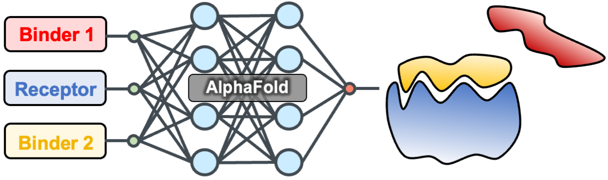

# Competitive_binding

* AlphaFold predictions were done with local install [ColabFold](https://github.com/sokrypton/ColabFold). 

### Reference

- Chang, L. & Perez, A. "AlphaFold encodes the principles to identify high affinity peptide binders." Biorxiv 2022.03.18.484931 (2022) doi: [10.1101/2022.03.18.484931](https://www.biorxiv.org/content/10.1101/2022.03.18.484931v1.abstract) 
